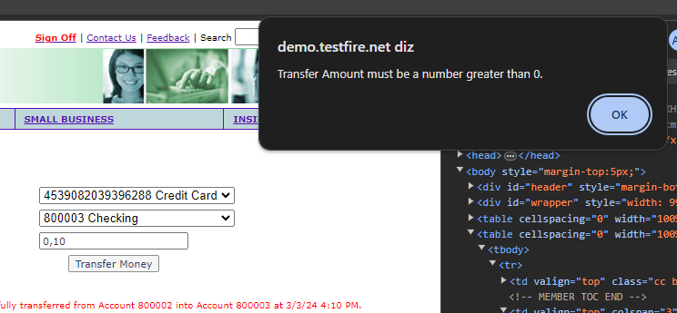

BUG 1 - Transfer Funds não aceita valor entre 0 e 1

Prezados, na tela de Trasnfer Funds, quando eu seleciono contas diferentes e coloco algum valor decimal positivo
aparece a mensagem de que o campo só aceita valores maior que 0. Segue o print abaixo:

BUG 2 - Validação de transação menor que 0,01 e maior que 99,999,990.99

Prezados, na tela de validação de transação para débito e para crédito existem valores abaixo de 0,01 e acima de 99,999,990.99.
Na regra de negócio diz que não pode aceitar. Segue o print abaixo:

